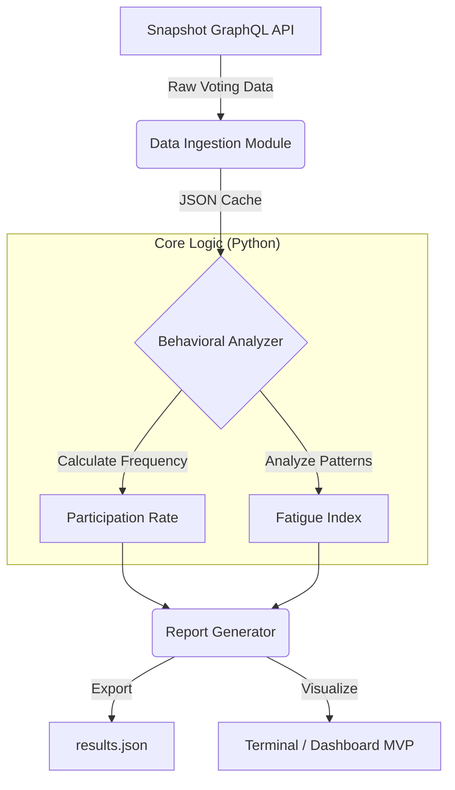

# System Architecture & Data Flow

## 1. High-Level Overview

**Participation Architecture** is designed as a lightweight, modular data pipeline (ETL). It extracts raw voting history from off-chain governance platforms (Snapshot), processes it through a behavioral analysis engine based on Self-Determination Theory (SDT), and outputs actionable "Health Metrics" for Arbitrum DAO delegates.

**Design Philosophy:** Privacy-first, client-side execution. No external database is required for the MVP phase; data is processed in-memory or cached locally.

---

## 2. Data Flow Diagram

The system follows a linear flow from Data Ingestion to Metric Calculation.



---

## 3. Module Description

### A. Data Ingestion Layer (`/src/collector`)

**Purpose:** Extract raw voting data from Snapshot Hub

- **Source:** Snapshot Hub (GraphQL API)
- **Function:** Fetches voting history for specific Arbitrum spaces
- **Privacy:** Only accesses public, on-chain/off-chain voting records. No PII (Personal Identifiable Information) is collected

**Key Operations:**
- Fetch proposals metadata
- Retrieve individual votes per proposal
- Cache data locally for offline analysis

---

### B. Behavioral Analysis Engine (`/src/analysis`)

This is the core research component that translates raw data into "Delegate Fatigue" metrics.

#### Implemented Metrics

**Metric 1: Participation Rate**
- Baseline activity tracking over rolling windows (30/90 days)
- Formula: `votes_cast / total_proposals_in_window`
- Output: Percentage (0.0 - 1.0)

**Metric 2: Fatigue Index**
- Identifies specific patterns such as rapid voting streaks followed by long inactivity (burnout signals)
- Components:
  - Long breaks between votes (inactivity penalty)
  - Burnout detection (rapid activity → silence)
  - Participation trend (declining vs stable)
- Output: Score (0-100, higher = more fatigued)

**Metric 3: Alignment Score** *(Planned for v2)*
- Measures consistency of voting behavior
- Detects strategic vs. conviction-based voting

---

### C. Output Layer

**Purpose:** Generate human-readable and machine-parseable reports

- **Format:** Human-readable JSON and CSV reports
- **Usage:** Data is structured to be easily readable by researchers or ingested by future frontend dashboards

**Output Types:**
1. **JSON Results** - Individual delegate metrics
2. **Health Summary** - Aggregate DAO statistics
3. **Markdown Reports** - Executive summaries with tables

---

## 4. Project Structure

The project follows a standard Python research structure to ensure reproducibility.

```bash
participation-architecture/
├── data/                  # Local cache for raw Snapshot data (git-ignored)
│   ├── cache/            # Raw JSON from Snapshot API
│   ├── results.json      # Analysis output
│   └── report.md         # Generated reports
├── docs/                  # Research notes & SDT methodology
│   ├── sdt-framework.md  # Theoretical background
│   └── metrics.md        # Metric definitions
├── src/
│   ├── collector.py       # API handlers & GraphQL queries
│   ├── analysis.py        # SDT logic & metric calculations
│   └── main.py            # CLI entry point
├── tests/                 # Unit tests for data integrity
│   ├── test_collector.py
│   └── test_analysis.py
├── architecture.md        # System documentation (This file)
├── requirements.txt       # Python dependencies
└── README.md              # Project overview
```

---

## 5. Tech Stack

| Component | Technology | Purpose |
|-----------|-----------|---------|
| **Language** | Python 3.10+ | Core implementation |
| **Data Processing** | Pandas | DataFrame operations |
| **API Interface** | Requests / GraphQL | Snapshot API communication |
| **Testing** | Pytest | Unit & integration tests |
| **Documentation** | Markdown / Mermaid.js | System docs & diagrams |

---

## 6. Data Privacy & Ethics

### Privacy Guarantees

- ✅ **No PII Collection** - Only public wallet addresses (pseudonymous)
- ✅ **No External Storage** - All data processed locally
- ✅ **Opt-in Only** - Users control their participation data
- ✅ **Transparent Metrics** - Open-source algorithms

### Ethical Considerations

1. **Stigma Prevention** - "Fatigue" is presented as a systemic issue, not individual failure
2. **Actionable Insights** - Metrics designed to improve governance health, not punish delegates
3. **Context Awareness** - System acknowledges valid reasons for inactivity (personal circumstances)

---

## 7. Performance Characteristics

### Scalability Metrics

| Parameter | MVP Target | Notes |
|-----------|-----------|-------|
| Proposals Analyzed | 50-100 | Adjustable via CLI |
| Delegates Tracked | 500-1000 | No hard limit |
| Processing Time | < 2 minutes | For 100 proposals |
| Memory Footprint | < 100 MB | In-memory processing |

### API Rate Limits

- **Snapshot API:** ~1 request/second (self-imposed)
- **Caching Strategy:** 24-hour TTL for proposal data

---

## 8. Future Enhancements (Roadmap)

### Phase 2: Advanced Analytics
- Alignment Score implementation
- Network analysis (delegate clusters)
- Predictive fatigue modeling

### Phase 3: Dashboard
- Web-based visualization
- Real-time monitoring
- Interactive delegate profiles

### Phase 4: Integration
- Tally API support
- Multi-DAO comparison
- Governance alerts system

---

## 9. Dependencies & Setup

### Installation

```bash
# Clone repository
git clone https://github.com/your-org/participation-architecture
cd participation-architecture

# Create virtual environment
python -m venv venv
source venv/bin/activate  # On Windows: venv\Scripts\activate

# Install dependencies
pip install -r requirements.txt
```

### Configuration

No API keys required - Snapshot Hub is publicly accessible.

Optional: Set custom cache directory via environment variable:
```bash
export PA_CACHE_DIR="/custom/path/to/cache"
```

---

## 10. Testing Strategy

### Unit Tests
- Mock API responses for deterministic testing
- Validate metric calculations against known datasets
- Edge case handling (empty votes, single-delegate scenarios)

### Integration Tests
- End-to-end pipeline validation
- Real Snapshot API calls (rate-limited)

### Run Tests
```bash
pytest tests/ -v --cov=src
```

---

## 11. Contributing

This is a research project. Contributions welcome in:
- Metric refinement based on SDT literature
- Additional governance platforms (Tally, Commonwealth)
- Statistical validation of fatigue indicators

See `CONTRIBUTING.md` for guidelines.

---

## 12. License & Attribution

**License:** MIT (Open Source)

**Citation:**
```
@software{participation_architecture_2024,
  title = {Participation Architecture: SDT-Based Delegate Fatigue Analysis},
  author = {Your Name},
  year = {2024},
  url = {https://github.com/your-org/participation-architecture}
}
```

---

**Last Updated:** 2024-11-19  
**Version:** 0.1.0-MVP
