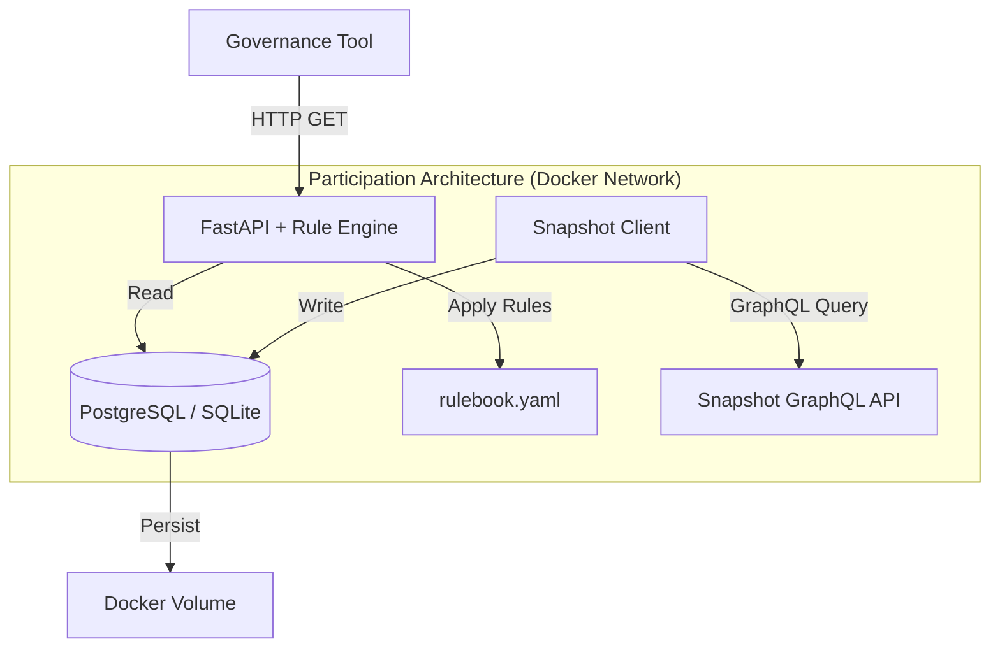

# System Architecture & Data Flow

## 1. High-Level Overview

**Participation Architecture** is a containerized microservice that provides **governance data normalization + deterministic triage rules** as a REST API. It enables governance tool builders to consume standardized proposal feeds with transparent priority scoring - without building custom infrastructure.

**Current Status:** Engineering Beta. The system successfully ingests Arbitrum DAO proposals from Snapshot and provides API endpoints for normalized data access.

### Design Philosophy

- **Developer-First:** Stable schemas, versioned rulebook, comprehensive docs
- **Transparent Logic:** No black boxes - every score includes rule IDs that fired
- **Infrastructure-as-Code:** Fully containerized (Docker) for reproducible deployment
- **Modular:** Swap ingestion sources, extend rulebook without breaking API contracts

---

## 2. Architecture Diagram



**Data Flow:**
1. **Ingestion:** `snapshot_client.py` pulls governance data from Snapshot GraphQL API
2. **Normalization:** Store in consistent schema (proposals table)
3. **Rule Application:** FastAPI reads DB + applies rulebook logic
4. **Response:** JSON with `priority_score`, `labels`, `reasons`, `recommended_handling`

---

## 3. Module Description

### A. API Layer (`app/main.py`)

**Technology:** FastAPI (Python 3.11+)

**Key Endpoints (Grant Deliverables):**
- `/proposals/feed` - Normalized proposals with triage scores
- `/proposals/{id}` - Single proposal with full rule audit trail
- `/delegates/{address}/fatigue` - Delegate Fatigue Index
- `/health` - System status

**Features:**
- Auto-generated OpenAPI/Swagger docs at `/docs`
- Async request handling
- Pydantic validation for type safety
- CORS support

---

### B. Data Layer (`app/db/`)

**Technology:** PostgreSQL / SQLite + SQLAlchemy 2.0

**Schema (Current):**

```python
class Proposal(Base):
    id: str              # Snapshot proposal ID
    title: str           # Proposal title
    created: int         # Unix timestamp
    start: int           # Voting start
    end: int             # Voting end
    state: str           # active/closed/pending
    author: str          # Creator address
    space_id: str        # DAO space
    choices: list        # Voting options
    votes: int           # Number of votes
    # Computed fields (populated by rule engine)
    priority_score: int  # 0-100
    labels: list         # [treasury, elections, etc.]
```

**Ingestion:**
```bash
python app/services/snapshot_client.py
# Output: 💾 Database updated: +200 new proposals
```

---

### C. Rule Engine (`app/services/rule_engine.py` - Planned M1)

**Rulebook Format (`rulebook.yaml`):**

```yaml
version: "1.0"
rules:
  - id: rule_treasury_large
    category: treasury
    condition: "amount > 100000"
    priority_boost: 30
    labels: [treasury, high_value]
    recommended_handling: deep_review
    
  - id: rule_routine_ops
    category: operations
    condition: "routine_approval == true"
    priority_boost: -20
    labels: [routine_ops]
    recommended_handling: fast_track
    
  - id: rule_elections
    category: governance
    condition: "'election' in title.lower()"
    priority_boost: 25
    labels: [elections, strategic]
    recommended_handling: deep_review
```

**Application Logic:**

```python
def apply_rules(proposal: Proposal, rulebook: Rulebook) -> TriageResult:
    """
    Apply deterministic rules to proposal.
    Returns: priority_score, labels, reasons, recommended_handling
    """
    matched_rules = []
    priority_score = 50  # baseline
    
    for rule in rulebook.rules:
        if evaluate_condition(proposal, rule.condition):
            matched_rules.append(rule.id)
            priority_score += rule.priority_boost
            labels.extend(rule.labels)
    
    return TriageResult(
        priority_score=clamp(priority_score, 0, 100),
        labels=list(set(labels)),
        reasons=matched_rules,
        recommended_handling=determine_handling(priority_score)
    )
```

**Transparency:** Every API response includes `reasons` field listing rule IDs that fired.

---

### D. Fatigue Index Module (`app/services/fatigue_calculator.py` - Planned M2)

**Formula (Transparent, No ML):**

```python
def calculate_fatigue_index(address: str, window_days: int = 30) -> FatigueResult:
    """
    Compute delegate fatigue using deterministic proxies.
    
    Components:
    - volume (40%): proposals per time window
    - concurrency (25%): simultaneous active votes
    - burstiness (20%): cadence spike detection
    - reading_time_proxy (10%): word count / baseline speed
    - novelty_proxy (5%): new domain tags vs routine
    """
    proposals = get_proposals_in_window(window_days)
    
    volume_score = len(proposals) / BASELINE_MONTHLY_PROPOSALS
    concurrency_score = count_simultaneous_votes(address, proposals)
    burstiness_score = detect_voting_spikes(address, proposals)
    reading_time = sum(p.word_count for p in proposals) / READING_SPEED
    novelty_score = count_new_domains(proposals) / len(proposals)
    
    fatigue = (
        volume_score * 0.40 +
        concurrency_score * 0.25 +
        burstiness_score * 0.20 +
        (reading_time / SUSTAINABLE_HOURS) * 0.10 +
        novelty_score * 0.05
    ) * 100
    
    return FatigueResult(
        fatigue_index=min(fatigue, 100),
        components={
            "volume_7d": count_proposals(7),
            "volume_30d": count_proposals(30),
            "concurrency": concurrency_score,
            "burstiness_score": burstiness_score,
            "reading_time_proxy": reading_time
        }
    )
```

---

## 4. Project Structure

```
participation-architecture/
├── app/
│   ├── core/
│   │   └── config.py           # Settings management
│   ├── db/
│   │   ├── models.py           # SQLAlchemy models
│   │   └── session.py          # DB connection
│   ├── schemas/
│   │   ├── proposals.py        # Pydantic models
│   │   └── fatigue.py          # Fatigue response schemas
│   ├── services/
│   │   ├── snapshot_client.py  # ✅ Data ingestion (working)
│   │   ├── rule_engine.py      # 🟡 Triage rules (M1)
│   │   └── fatigue_calculator.py # 🟡 Fatigue index (M2)
│   ├── api/v1/
│   │   ├── proposals.py        # Proposal endpoints
│   │   └── delegates.py        # Delegate endpoints
│   └── main.py                 # FastAPI app
├── rulebook.yaml               # 🟡 Rule definitions (M1)
├── rulebook.md                 # 🟡 Rule documentation (M1)
├── tests/                      # 🟡 Test suite (M1)
├── alembic/                    # 🟡 Migrations (M1)
├── docker-compose.yml
├── Dockerfile
├── requirements.txt
└── README.md
```

**Legend:**
- ✅ Working
- 🟡 In Development (Grant Scope)

---

## 5. Tech Stack

| Component | Technology | Rationale |
|-----------|-----------|-----------|
| **API** | FastAPI | Native async, auto-generated OpenAPI |
| **DB** | PostgreSQL/SQLite | Production flexibility |
| **ORM** | SQLAlchemy 2.0 | Type-safe queries |
| **Validation** | Pydantic v2 | Runtime type checking |
| **Migrations** | Alembic | Versioned schema changes |
| **GraphQL** | GQL library | Type-safe Snapshot queries |
| **Testing** | Pytest | Standard Python testing |
| **Containers** | Docker Compose | One-command deployment |

**Dependencies:**

```txt
# Core
fastapi==0.109.0
uvicorn[standard]==0.25.0

# Database
sqlalchemy==2.0.23
alembic==1.13.1

# Validation
pydantic==2.5.3
pydantic-settings==2.1.0

# External APIs
gql[all]==3.5.0
httpx==0.26.0

# Development
pytest==7.4.3
black==23.12.1
ruff==0.1.9
```

---

## 6. API Response Examples

### Get Proposals Feed

**Request:**
```http
GET /proposals/feed?limit=10&offset=0
```

**Response:**
```json
{
  "proposals": [
    {
      "id": "0xabc123",
      "title": "Treasury Allocation Q1 2026",
      "created": 1704067200,
      "priority_score": 85,
      "labels": ["treasury", "high_value", "strategic"],
      "reasons": ["rule_treasury_large", "rule_strategic"],
      "recommended_handling": "deep_review",
      "metadata": {
        "author": "0x1c6e...",
        "state": "active",
        "votes": 234
      }
    }
  ],
  "total": 234,
  "page": 1
}
```

### Get Delegate Fatigue

**Request:**
```http
GET /delegates/0x1c6e.../fatigue
```

**Response:**
```json
{
  "address": "0x1c6e...",
  "fatigue_index": 73,
  "risk_level": "warning",
  "components": {
    "volume_7d": 12,
    "volume_30d": 45,
    "concurrency": 3,
    "burstiness_score": 0.82,
    "reading_time_proxy": 180
  },
  "computed_at": "2026-01-19T10:30:00Z"
}
```

---

## 7. Performance Targets

| Metric | Target | Implementation |
|--------|--------|----------------|
| **API Latency (cached)** | <400ms | Response caching (M2) |
| **API Latency (uncached)** | <2s | Optimized queries + indexing |
| **Ingestion Speed** | <30s for 200 proposals | Batch GraphQL queries |
| **Database Size** | <100MB for 1yr data | ~500 bytes per proposal |
| **Test Coverage** | >80% | Pytest suite (M1) |
| **Documentation UX** | 70% complete Quickstart in <30min | Structured tutorials (M2) |

**Database Indexes (Planned M1):**

```sql
CREATE INDEX idx_proposals_created ON proposals(created);
CREATE INDEX idx_proposals_space ON proposals(space_id);
CREATE INDEX idx_proposals_author ON proposals(author);
```

---

## 8. Security & Data Privacy

### Current Implementation

- ✅ **Input Validation:** Pydantic schemas prevent injection
- ✅ **CORS Policy:** Configurable origins
- ✅ **Public Data Only:** On-chain/Snapshot data (no PII)
- ✅ **Read-Only API:** No write endpoints

### Planned (Post-Grant)

- API key authentication
- Rate limiting (100 req/hour per key)
- Request logging

### Ethical Considerations

- **Transparent Algorithms:** All rulebook logic is open-source
- **No Manipulation:** Scores are descriptive, not prescriptive
- **Academic Use:** Findings published with CC-BY license
- **Community Consent:** Delegates informed before case studies

---

## 9. Deployment

### Local Development

```bash
# 1. Install
pip install -r requirements.txt

# 2. Ingest data
python app/services/snapshot_client.py

# 3. Run server
uvicorn app.main:app --reload

# 4. Test
curl http://localhost:8000/health
```

### Docker Deployment

```bash
docker compose up --build
```

### Production (Planned - Post Grant)

- **Hosting:** Railway/DigitalOcean
- **Monitoring:** Basic health checks
- **Logs:** Structured JSON output
- **Backups:** Daily database snapshots

---

## 10. Roadmap Alignment

### Milestone 1: Pipeline + Rulebook ($3,500)

- [x] FastAPI scaffold
- [x] Database schema
- [x] Snapshot ingestion (working)
- [ ] Rule engine implementation
- [ ] Rulebook v1 (YAML + docs)
- [ ] Test suite (≥20 rule cases)
- [ ] OpenAPI docs + Quickstart

### Milestone 2: Fatigue Index + Docs ($3,000)

- [ ] Fatigue calculator (deterministic formula)
- [ ] Performance optimization (caching, indexing)
- [ ] Full documentation
- [ ] 2-3 video tutorials
- [ ] Tagged release (v0.1)

---

## 11. Testing Strategy

### Test Pyramid

```
      ┌──────────┐
      │   E2E    │  (10% - API workflows)
      ├──────────┤
      │Integration│  (30% - API + DB)
      ├──────────┤
      │   Unit   │  (60% - Rule logic)
      └──────────┘
```

**Example Unit Test:**

```python
def test_rule_treasury_large():
    proposal = Proposal(
        title="Treasury Allocation",
        metadata={"amount": 150000}
    )
    result = apply_rules(proposal, rulebook)
    assert "rule_treasury_large" in result.reasons
    assert result.priority_score >= 80
```

---

## 12. Known Limitations

### Current (v0.6.0)

- ⚠️ **Snapshot/Tally only** (on-chain voting not in scope)
- ⚠️ **English-language proposals** (rulebook conditions are English-based)
- ⚠️ **Arbitrum focus** (multi-chain support requires connector extensions)
- ⚠️ **No authentication** (open API during beta)
- ⚠️ **Manual ingestion** (scheduled background tasks planned post-grant)

### Design Trade-offs

1. **YAML Rulebook vs Code:** Easier for non-developers to customize, but limited expression power
2. **Deterministic vs ML:** Transparent and testable, but less adaptive
3. **SQLite Support:** Great for dev, but requires PostgreSQL migration path for production
4. **No Real-time Updates:** Polling-based ingestion (webhooks planned post-grant)

---

## 13. Contributing

**Architecture Proposals:**
1. Open GitHub Issue with `[ARCHITECTURE]` tag
2. Describe problem + solution
3. Submit PR with tests + docs

**Architecture Decision Records (ADRs):**

```markdown
# ADR-001: YAML Rulebook Format

**Status:** Accepted  
**Date:** 2026-01-19  

**Context:** Need configurable triage rules without code changes

**Decision:** Use YAML for rulebook with versioning

**Consequences:** Easy customization, limited to simple conditions
```

---

## Contact

- **Architecture Questions:** [GitHub Issues](https://github.com/pawel-wyszomirski/participation-architecture/issues)
- **Integration Support:** @pwyszomirski on Twitter/X

---

**Last Updated:** 19 January 2026  
**Version:** 0.6.0 (Grant Resubmission)  
**Status:** 🟡 Engineering Beta | Grant Scope Defined
