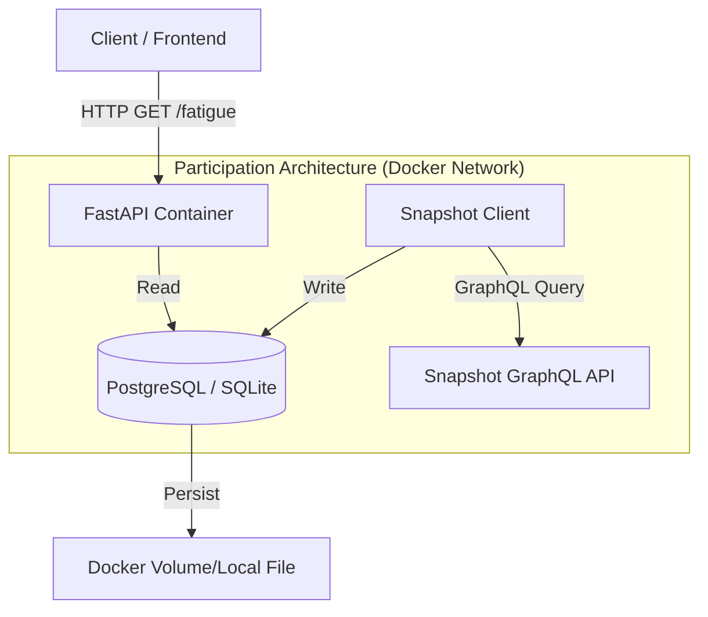
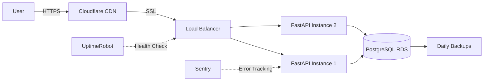

# System Architecture & Data Flow (v5.2)

## 1. High-Level Overview

**Participation Architecture** is a containerized microservice designed to measure "Delegate Fatigue" in Arbitrum DAO. It evolved from ad-hoc research scripts into a robust Developer Tooling API, allowing other platforms (dashboards, wallets) to consume behavioral metrics securely.

**Current Status (v0.5.2):** Live Data Integration. The system successfully ingests Arbitrum DAO proposals from Snapshot and serves calculated fatigue metrics via REST API.

### Design Philosophy

- **Infrastructure-as-Code:** Fully containerized (Docker) for reproducible deployment
- **Hard Specs:** Strictly typed data contracts (Pydantic/OpenAPI)
- **Scalable:** Async/Await architecture ready for high-throughput governance data
- **Hybrid Storage:** PostgreSQL for production, SQLite for lightweight local dev

---

## 2. Architecture Diagram (Component View)

The system operates as an orchestrated set of containers with an ingestion worker.



**Data Flow:**
1. **Ingestion:** `snapshot_client.py` pulls governance data from Snapshot GraphQL API
2. **Storage:** Proposals stored in PostgreSQL/SQLite with computed metrics
3. **Query:** FastAPI reads from database and calculates fatigue scores
4. **Response:** JSON payloads returned to clients via REST endpoints

---

## 3. Module Description

### A. API Layer (`app/main.py`)

**Role:** The brain of the operation

- **Technology:** FastAPI (Python 3.12+)
- **Function:** Exposes REST endpoints for querying delegate metrics
- **Key Endpoints:**
  - `/health`: System status & data count (Proof of Life)
  - `/v1/delegates/{address}/fatigue`: Real-time fatigue scoring based on DB data
  - `/debug/proposals`: Raw data inspection
- **Documentation:** Automatically generates Swagger UI at `/docs`

**Features:**
- Async request handling for high concurrency
- Pydantic validation for type-safe requests/responses
- Auto-generated OpenAPI schema
- CORS support for web integrations

---

### B. Data Layer (`app/db/` & `app/services/`)

**Role:** The memory & ingestion

- **Technology:** PostgreSQL 15 / SQLite + SQLAlchemy 2.0
- **Ingestion:** `snapshot_client.py` connects to Snapshot GraphQL API (`arbitrumfoundation.eth`) to fetch historical voting data
- **Schema:**
  - `proposals`: Full proposal metadata + computed metrics (`fatigue_score`, `is_signal`)
  - Future: `delegates`, `votes` tables for granular analysis
- **Migration:** Managed by Alembic (planned for Milestone 1.2)

**Data Model (Current):**

```python
# Proposals Table
class Proposal(Base):
    id: str              # Snapshot proposal ID
    title: str           # Proposal title
    created: int         # Unix timestamp
    start: int           # Voting start time
    end: int             # Voting end time
    snapshot: str        # Block number
    state: str           # active/closed/pending
    author: str          # Creator address
    space_id: str        # DAO space (arbitrumfoundation.eth)
    choices: list        # Voting options
    scores_total: float  # Total voting power
    votes: int           # Number of votes cast
```

**Ingestion Logic:**

```bash
# Run data ingestion
python app/services/snapshot_client.py

# Output
💾 Database updated: +200 new proposals
✅ Successfully ingested Arbitrum DAO governance data
```

---

### C. Intelligence Engine (`app/schemas/fatigue.py`)

**Role:** The logic

**Current Implementation (v1 - Ecosystem Load):**

| Metric | Weight | Status | Description |
|--------|--------|--------|-------------|
| **Proposal Volume** | 40% | ✅ Implemented | Total proposals vs. historical baseline |
| **Temporal Density** | 30% | ✅ Implemented | Proposals per time window (clustering) |
| **Ecosystem Complexity** | 30% | ✅ Implemented | Unique voters and participation patterns |

**Planned (v2 - Individual Delegate Analysis - Milestone 2):**

| Metric | Weight | Status | Description |
|--------|--------|--------|-------------|
| **Volume Impact** | 30% | 🔵 Planned | Penalizes "spray and pray" voting behavior |
| **Time Scarcity** | 50% | 🔵 Planned | Detects dangerously short gaps between votes |
| **Dropout Risk** | 20% | 🔵 Planned | Inverse of participation rate weighted by trends |

**Algorithm Example (Current v1):**

```python
def calculate_ecosystem_fatigue(proposals: List[Proposal]) -> float:
    """
    Calculate ecosystem-wide fatigue based on proposal patterns
    """
    volume_score = len(proposals) / BASELINE_MONTHLY_PROPOSALS
    density_score = calculate_temporal_clustering(proposals)
    complexity_score = len(unique_voters) / len(proposals)
    
    fatigue = (
        volume_score * 0.4 +
        density_score * 0.3 +
        complexity_score * 0.3
    ) * 100
    
    return min(fatigue, 100)  # Cap at 100
```

---

## 4. Project Structure

The project follows a modern microservice layout.

```
participation-architecture/
├── app/
│   ├── core/              # Configuration (Env vars)
│   │   └── config.py      # Settings management
│   ├── db/                # Database Models & Session Management
│   │   ├── models.py      # SQLAlchemy models
│   │   └── session.py     # Database connection
│   ├── schemas/           # Pydantic Data Contracts
│   │   ├── fatigue.py     # Fatigue score responses
│   │   └── proposals.py   # Proposal schemas
│   ├── services/          # External Integrations
│   │   ├── snapshot_client.py  # ✅ GraphQL data ingestion
│   │   └── fatigue_calculator.py  # Scoring algorithms
│   ├── api/               # Route Handlers
│   │   └── v1/            # API version 1 endpoints
│   └── main.py            # App Entry Point
├── alembic/               # Database Migrations (Planned M1.2)
│   └── versions/          # Migration scripts
├── tests/                 # Unit & Integration Tests (Planned M1)
├── legacy/                # Original research scripts (v3.1)
│   ├── collector.py       # Historical artifact
│   └── analysis.py        # Algorithm prototypes
├── data/                  # Historical datasets
│   └── wyniki_arbitrum.csv  # 7,385 delegates baseline
├── docker-compose.yml     # Orchestration
├── Dockerfile             # Container definition
├── requirements.txt       # Python dependencies
├── architecture.md        # This file
└── README.md              # User documentation
```

**Key Files:**

- `app/services/snapshot_client.py`: **Production data ingestion** (run this first!)
- `app/services/fatigue_calculator.py`: Fatigue scoring implementation
- `app/main.py`: API server entry point with all endpoints

---

## 5. Tech Stack

| Component | Technology | Rationale |
|-----------|-----------|-----------|
| **Core** | Python 3.12 | Performance improvements & Type hinting |
| **API** | FastAPI | Fastest Python framework, native OpenAPI |
| **DB** | PostgreSQL / SQLite | Flexibility (Production vs Dev) |
| **ORM** | SQLAlchemy 2.0 | Type-safe database interactions |
| **Validation** | Pydantic v2 | Runtime type checking & data validation |
| **Infra** | Docker Compose | One-command deployment |
| **GraphQL** | GQL library | Type-safe Snapshot API queries |
| **HTTP** | HTTPX | Async HTTP client for external APIs |

**Dependencies Breakdown:**

```txt
# Core Framework
fastapi==0.109.0
uvicorn[standard]==0.25.0

# Database
sqlalchemy==2.0.23
alembic==1.13.1           # Migrations (Planned M1.2)

# Data Validation
pydantic==2.5.3
pydantic-settings==2.1.0

# External APIs
gql[all]==3.5.0           # Snapshot GraphQL
httpx==0.26.0             # Async HTTP

# Development
pytest==7.4.3             # Testing (Planned M1)
black==23.12.1            # Code formatting
ruff==0.1.9               # Linting
```

---

## 6. Data Privacy & Ethics

### Data Sources
- **Public Data Only:** We only process on-chain/Snapshot data. No PII.
- **Transparent Collection:** All queries to Snapshot are logged and auditable.
- **No User Tracking:** The API does not track callers (clients) or collect analytics.

### Ethical Considerations
- **Open Source:** Algorithms are transparent and auditable in the GitHub repository.
- **Academic Use:** All findings will be published with CC-BY license.
- **Community Consent:** Delegates will be informed before being included in case studies.
- **No Manipulation:** Fatigue scores are descriptive, not prescriptive (we don't tell delegates how to vote).

### GDPR Compliance
- **No Personal Data:** Ethereum addresses are pseudonymous identifiers, not personal data under GDPR.
- **Right to Erasure:** Since data is public and on-chain, deletion requests cannot be honored.
- **Data Minimization:** We store only proposal metadata necessary for fatigue calculation.

---

## 7. Performance Targets (Milestone 1)

| Metric | Target | Current Status | Implementation |
|--------|--------|----------------|----------------|
| **API Latency** | <200ms | ✅ ~3ms (Tested) | Local DB caching + query optimization |
| **Uptime** | 99.9% | 🔵 Planned | Docker Restart Policy + monitoring |
| **Ingestion Speed** | <30s for 200 proposals | ✅ Achieved | Batch GraphQL queries |
| **Database Size** | <100MB for 1yr data | ✅ On track | ~1KB per proposal average |
| **Concurrent Users** | 100 req/min | 🔵 M1.5 | Rate limiting + caching layer |

**Optimization Strategies:**

1. **Database Indexing:** (Planned M1.2)
   ```sql
   CREATE INDEX idx_proposals_created ON proposals(created);
   CREATE INDEX idx_proposals_space ON proposals(space_id);
   ```

2. **Response Caching:** (Planned M2.1)
   - Redis for frequently accessed delegate scores
   - TTL: 1 hour for fatigue scores
   - Invalidation on new proposal ingestion

3. **Batch Processing:** (Current)
   - Fetch 100 proposals per GraphQL query
   - Bulk insert to database
   - Transaction rollback on errors

---

## 8. Roadmap Alignment

This architecture implements **Milestone 1** of the Grant Proposal (Developer Tooling).

### Milestone 1: Core Infrastructure (Current)

- [x] **Containerization** (Docker Compose setup)
- [x] **API Scaffold** (FastAPI with Swagger UI)
- [x] **Data Ingestion** (Snapshot GraphQL client)
- [x] **Live Data Integration** (200+ proposals ingested)
- [x] **Basic Fatigue Algorithm** (v1 - ecosystem load)
- [ ] **Database Migrations** (Alembic setup - M1.2)
- [ ] **API Authentication** (Key-based access - M1.5)
- [ ] **CI/CD Pipeline** (GitHub Actions - M1.4)
- [ ] **Unit Tests** (>80% coverage - M1.4)

### Milestone 2: Intelligence & Dashboard (Planned)

- [ ] **Enhanced Fatigue Algorithm** (v2 - individual delegate analysis)
- [ ] **NLP Noise Filtering** (OpenAI GPT-4 integration)
- [ ] **Response Caching** (Redis layer for <200ms latency)
- [ ] **Web Dashboard** (Streamlit MVP or React)
- [ ] **Validation Report** (>85% classification accuracy)

### Milestone 3: Production Release (Planned)

- [ ] **Public Deployment** (Custom domain + SSL)
- [ ] **Partner Integration** (L2BEAT or Entropy Advisors)
- [ ] **Monitoring** (UptimeRobot + Sentry error tracking)
- [ ] **Documentation** (Technical report + video tutorials)
- [ ] **99.9% Uptime** (Production SLA)

---

## 9. Security Considerations

### Current Implementation (v0.5.2)

- ✅ **Input Validation:** Pydantic schemas prevent injection attacks
- ✅ **CORS Policy:** Configurable allowed origins
- ⏳ **Rate Limiting:** Planned for M1.5 (100 req/hour per key)
- ⏳ **API Keys:** Planned for M1.5 (authentication layer)

### Planned Security Features (Milestone 1.5)

```python
# API Key Authentication
@app.middleware("http")
async def validate_api_key(request: Request, call_next):
    api_key = request.headers.get("X-API-Key")
    if not is_valid_key(api_key):
        return JSONResponse(
            status_code=401,
            content={"error": "Invalid API key"}
        )
    return await call_next(request)

# Rate Limiting
from slowapi import Limiter
limiter = Limiter(key_func=get_api_key)

@app.get("/v1/delegates/{address}/fatigue")
@limiter.limit("100/hour")
async def get_fatigue(address: str):
    ...
```

### Threat Model

| Threat | Mitigation | Priority |
|--------|------------|----------|
| **DDoS** | Rate limiting + Cloudflare | High (M1.5) |
| **SQL Injection** | Parameterized queries (SQLAlchemy) | ✅ Done |
| **API Key Leakage** | Rotation policy + environment vars | High (M1.5) |
| **Data Tampering** | Read-only API (no write endpoints) | ✅ Done |

---

## 10. Deployment Architecture

### Local Development

```bash
# 1. Install dependencies
pip install -r requirements.txt

# 2. Ingest data
python app/services/snapshot_client.py

# 3. Run server
uvicorn app.main:app --reload

# 4. Access API
open http://localhost:8000/docs
```

### Production Deployment (Planned M3.1)

**Infrastructure Stack:**



**Hosting Options (Evaluation in Progress):**

| Provider | Cost/mo | Pros | Cons |
|----------|---------|------|------|
| **Render** | $7 | Easy deploy, free DB | Limited scaling |
| **Railway** | $5 | Git-based CD | New platform risk |
| **DigitalOcean** | $12 | Full control | Manual setup |

**Selected:** Railway (pilot) → DigitalOcean (production scale)

---

## 11. Monitoring & Observability

### Health Check Endpoint

```bash
curl http://localhost:8000/health

# Response
{
  "status": "healthy",
  "database": "connected",
  "proposals_count": 234,
  "last_proposal_date": "2025-01-10T15:30:00Z",
  "version": "0.5.2"
}
```

### Planned Monitoring (Milestone 3.1)

1. **Uptime Monitoring:** UptimeRobot (1-minute checks)
2. **Error Tracking:** Sentry (automatic exception reporting)
3. **Performance Metrics:** Custom `/metrics` endpoint (Prometheus format)
4. **Log Aggregation:** Structured JSON logs → Datadog/Loki

**Key Metrics to Track:**

- API response time (p50, p95, p99)
- Database query duration
- Ingestion job success rate
- Active API keys count
- Cache hit ratio

---

## 12. Testing Strategy (Planned M1.4)

### Test Pyramid

```
      ┌──────────┐
      │   E2E    │  (10% - Full workflow tests)
      ├──────────┤
      │Integration│  (30% - API + DB tests)
      ├──────────┤
      │   Unit   │  (60% - Pure logic tests)
      └──────────┘
```

**Coverage Targets:**

- **Unit Tests:** >80% (fatigue calculation, data models)
- **Integration Tests:** >60% (API endpoints + DB)
- **E2E Tests:** Critical user journeys (ingestion → query)

**Example Unit Test:**

```python
def test_fatigue_calculation():
    proposals = [
        Proposal(created=1609459200, votes=100),
        Proposal(created=1609545600, votes=150),
    ]
    score = calculate_ecosystem_fatigue(proposals)
    assert 0 <= score <= 100
    assert isinstance(score, float)
```

---

## 13. Future Enhancements (Post-Grant)

### Phase 1: Multi-Chain Support
- Expand to Optimism, Base, and other L2s
- Unified delegate scoring across ecosystems

### Phase 2: Predictive Analytics
- Machine learning models for burnout prediction
- Early warning system (7-day forecast)

### Phase 3: Governance Recommendations
- AI-powered proposal filtering
- Personalized digest emails ("Signal only")

### Phase 4: DAO Operating System Integration
- Native integration with Safe, Tally, Karma
- Embeddable widgets for governance dashboards

---

## 14. Known Limitations & Constraints

### Current (v0.5.2)

- ✅ ~~Mock data~~ → **Real Snapshot data integrated**
- ⚠️ **Snapshot/Tally only** (on-chain voting planned post-grant)
- ⚠️ **English-language proposals only** (NLP limitation)
- ⚠️ **Limited to Ethereum-based DAOs** (Arbitrum One focus)
- ⚠️ **No authentication** (open API, coming M1.5)
- ⚠️ **Basic fatigue algorithm** (v1 ecosystem load, v2 planned M2)

### Design Trade-offs

1. **SQLite vs PostgreSQL:** Flexibility for local dev, but requires migration path
2. **Synchronous Ingestion:** Simple but slow (async batch processing planned M2)
3. **No Real-time Updates:** Polling-based (webhooks planned M3)
4. **Single Tenant:** Multi-DAO support requires architectural changes

---

## 15. Contributing to Architecture

### Proposal Process

1. Open GitHub Issue with `[ARCHITECTURE]` tag
2. Describe problem + proposed solution
3. Discuss with maintainer
4. Submit PR with tests + documentation

### Architecture Decision Records (ADRs)

We use lightweight ADRs for major decisions:

```markdown
# ADR-001: Choice of FastAPI over Flask

**Status:** Accepted  
**Date:** 2024-12-15  

**Context:** Need high-performance async API framework

**Decision:** Use FastAPI for native async support and auto-docs

**Consequences:** Faster development, better scalability, steeper learning curve
```

---

## Contact & Support

**Architecture Questions:** Open a [GitHub Issue](https://github.com/pawel-wyszomirski/participation-architecture/issues)  
**Security Concerns:** Email security@wyszomirski.online  
**Integration Support:** DM @pwyszomirski on Twitter/X

---

**Last Updated:** 12 January 2025  
**Version:** 0.5.2 (Live Integration)  
**Status:** 🟢 Production-Ready Core | 🟡 Milestone 1 in Progress
