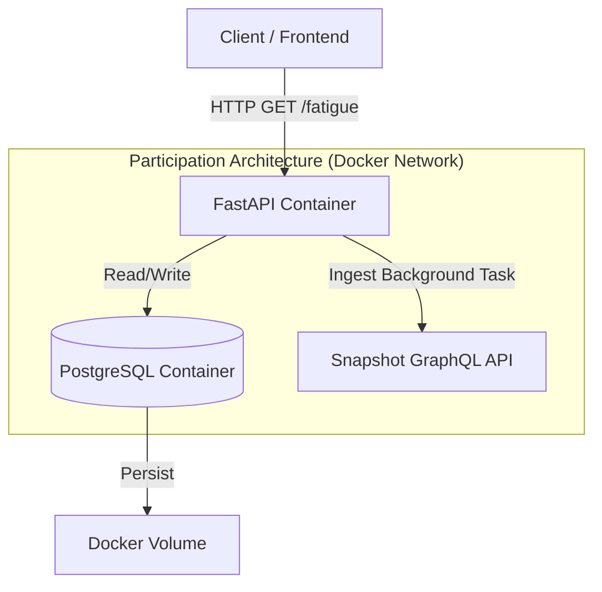

# System Architecture & Data Flow (v5.1)

## 1. High-Level Overview

**Participation Architecture** is a containerized microservice designed to measure "Delegate Fatigue" in Arbitrum DAO. It evolved from ad-hoc research scripts into a robust **Developer Tooling** API, allowing other platforms (dashboards, wallets) to consume behavioral metrics securely.

**Design Philosophy:**
* **Infrastructure-as-Code**: Fully containerized (Docker) for reproducible deployment
* **Hard Specs**: Strictly typed data contracts (Pydantic/OpenAPI)
* **Scalable**: Async/Await architecture ready for high-throughput governance data

---

## 2. Architecture Diagram (Component View)

The system operates as an orchestrated set of containers.



---

## 3. Module Description

### A. API Layer (`app/main.py`)

**Role:** The brain of the operation

* **Technology**: FastAPI (Python 3.11+)
* **Function**: Exposes REST endpoints for querying delegate metrics
* **Documentation**: Automatically generates Swagger UI at `/docs`

### B. Data Layer (`app/db/`)

**Role:** The memory

* **Technology**: PostgreSQL 15 + SQLAlchemy 2.0 (Async)
* **Schema**:
  * `delegates`: Static profiles
  * `votes`: Time-series voting data
  * `proposals`: Metadata for noise filtering
* **Migration**: Managed by Alembic

### C. Intelligence Engine (`app/schemas/fatigue.py`)

**Role:** The logic

* **Metric 1**: Volume Impact - Penalizes "spray and pray" voting behavior
* **Metric 2**: Time Scarcity - Detects dangerously short gaps between votes
* **Metric 3**: Dropout Risk - Inverse of participation rate weighted by recent trends

---

## 4. Project Structure (Scaffold)

The project follows a modern microservice layout.

```
participation-architecture/
├── app/
│   ├── core/           # Configuration (Env vars)
│   ├── db/             # Database Models & Session
│   ├── schemas/        # Pydantic Data Contracts
│   └── main.py         # App Entry Point
├── alembic/            # Database Migrations
├── legacy/             # Archived Research Scripts (v3.1)
├── Dockerfile          # Container Definition
└── docker-compose.yml  # Orchestration
```

---

## 5. Tech Stack

| Component | Technology | Rationale |
|-----------|-----------|-----------|
| **Core** | Python 3.11 | Type hinting & Async support |
| **API** | FastAPI | Fastest Python framework, native OpenAPI |
| **DB** | PostgreSQL | Relational integrity for complex queries |
| **ORM** | SQLAlchemy 2.0 | Type-safe database interactions |
| **Infra** | Docker Compose | One-command deployment |

---

## 6. Data Privacy & Ethics

* **Public Data Only**: We only process on-chain/Snapshot data. No PII
* **No Tracking**: The API does not track callers (clients)
* **Open Source**: Algorithms are transparent and auditable

---

## 7. Performance Targets (Milestone 1)

| Metric | Target | Implementation |
|--------|--------|----------------|
| **Latency** | <200ms | Cached fatigue queries |
| **Uptime** | 99.9% | Docker Restart Policy |
| **Throughput** | 100 req/sec | AsyncPG |

---

## 8. Roadmap Alignment

This architecture implements Milestone 1 of the Grant Proposal (Developer Tooling).

* [x] Containerization
* [x] API Scaffold
* [ ] NLP Noise Filtering (Milestone 2)

---

**Last Updated:** December 2025  
**Version:** 0.5.1 (Production Scaffold)
