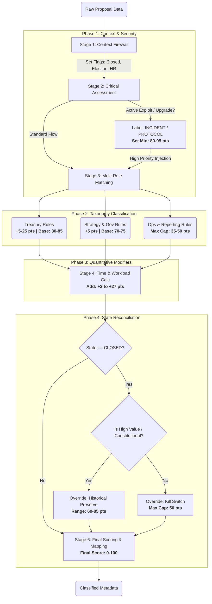

# Participation Architecture — Rulebook v2.5.0 (Context-Aware Deterministic)

**Purpose**  
This rulebook defines a **deterministic, auditable, context-aware** system for:

1) labeling governance items (proposals, votes, forum threads) with standardized **labels**,  
2) producing a **priority_score (0–100)** using transparent point rules, and  
3) returning **reasons** (rule IDs) + a **recommended_handling** value.

**Design goals**
- **No ML / no LLM / no semantic inference.**
- **Context-aware**: uses flags to prevent false positives (e.g., elections blocked from security incidents).
- Every output must be explainable as **"these rule IDs fired."**
- Rules must be stable, versioned, and testable.

**Non-goals**
- Predicting vote outcomes.
- Replacing human judgment.
- Building any UI/dashboard.

---

## 1) Scope

### 1.1 Covered item types
- `proposal` (onchain/offchain)
- `vote` (as an event tied to a proposal)
- `discussion` (forum thread / temperature check)

### 1.2 Supported venues (initial)
- Snapshot-style governance
- Tally-style governance

The ingestion layer maps venue-specific objects into a single normalized schema (below).

---

## 2) Normalized schema (inputs used by rules)

Rules MUST only rely on these normalized fields (if a field is missing, rules must handle it gracefully).

### 2.1 Core fields
- `item_id` (string)
- `venue` (enum: `snapshot|tally|forum|other`)
- `chain` (string; e.g., `arbitrum-one`)
- `item_type` (enum: `proposal|discussion`)
- `title` (string)
- `body` (string)
- `author` (string)
- `created_at` (timestamp)
- `start_at` (timestamp)
- `end_at` (timestamp)
- `state` (enum: `draft|active|closed|executed|defeated|expired|canceled|unknown`)

### 2.3 Text-derived fields (deterministic)
Derived deterministically during ingestion:
- `word_count` (int)
- `keyword_hits` (map[string]int) — counts for configured keyword groups

---

## 3) Outputs

Every item returns:
- `labels`: string[]
- `priority_score`: integer 0–100
- `recommended_handling`: enum
  - `urgent_deep_review`
  - `deep_review`
  - `standard_review`
  - `fast_track_ok`
  - `informational_only`
- `reasons`: rule_id[]
- `flags`: string[] (internal context flags for explainability)

---

## 4) Rule evaluation model

### 4.1 Evaluation phases (fixed order)

1) **Phase 0: Context Firewall** — set context flags (`STATE_CLOSED`, `CONTEXT_ELECTION`, etc.)
2) **Phase 1: Critical Rules** — security, protocol (respect context blocks)
3) **Phase 2: Standard Classification** — labels and base priorities
4) **Phase 3: Modifiers** — time, workload
5) **Phase 4: State-Based Kill Switch & Exceptions** — override for closed items
6) **Phase 5: Default** — ensure every item has classification
7) Clamp score to **0–100**

### 4.2 Conflict handling
- Labels are additive.
- Flags are additive.
- `min_priority = max(all mins)`
- `max_priority = min(all maxs)` (caps win)
- `score = clamp(score, min_priority, max_priority)`

---

## 5) Label taxonomy

### 5.1 Primary labels
- `SECURITY` / `INCIDENT` / `EMERGENCY`
- `PROTOCOL_UPGRADE`
- `PARAMETER_CHANGE`
- `NEW_PROGRAM` / `STRATEGY`
- `TREASURY`
- `ELECTIONS`
- `GOVERNANCE_FRAMEWORK`
- `OPERATIONS`
- `REPORTING`
- `META_GOV`
- `RESEARCH`
- `SPONSORSHIP`
- `UNCATEGORIZED`

### 5.2 Secondary labels (optional)
- `AUDIT`
- `BUDGET`
- `BUDGET_UNCLEAR`
- `VERY_LONG_FORM` / `LONG_FORM` / `MEDIUM_FORM` / `STANDARD_FORM`
- `TREASURY_TIER_1` / `TREASURY_TIER_2` / `TREASURY_TIER_3` / `TREASURY_TIER_4`

---

## 6) Priority score model

### 6.1 Score mapping
| Handling | Min | Max |
|----------|-----|-----|
| `urgent_deep_review` | 90 | 100 |
| `deep_review` | 70 | 89 |
| `standard_review` | 40 | 69 |
| `fast_track_ok` | 25 | 39 |
| `informational_only` | 0 | 24 |

### 6.2 Treasury tiers
| Min USD | Add | Set Min | Label |
|---------|-----|---------|-------|
| $10M | +25 | 85 | `TREASURY_TIER_1` |
| $1M | +20 | 75 | `TREASURY_TIER_2` |
| $100K | +15 | 60 | `TREASURY_TIER_3` |
| $10K | +10 | 45 | `TREASURY_TIER_4` |
| $1K | +5 | 30 | `TREASURY_TIER_5` |

### 6.3 Time sensitivity (active items only)
| Hours | Add |
|-------|-----|
| ≤ 24h | +15 |
| ≤ 48h | +10 |
| ≤ 72h | +5 |

### 6.4 Workload tiers
| Words | Add | Label |
|-------|-----|-------|
| ≥ 5,000 | +12 | `VERY_LONG_FORM` |
| ≥ 3,000 | +8 | `LONG_FORM` |
| ≥ 1,500 | +5 | `MEDIUM_FORM` |
| ≥ 800 | +2 | `STANDARD_FORM` |

---

## 7) Keyword groups (deterministic matching)

Matching is **case-insensitive** on `title + body`.

### 7.1 ACTIVE_INCIDENT_CUES (strict — only actual incidents)
- `active exploit`
- `under active attack`
- `funds are being drained`
- `funds stolen`
- `emergency pause`
- `bridge compromised`
- `critical breach`
- `post-mortem of incident`
- `security incident`
- `active hack`

### 7.2 UPGRADE_CUES
- `arbos upgrade`, `arbos version`
- `contract upgrade`, `hard fork`, `precompile update`, `sequencer upgrade`
- `implement improvements`, `pricing algorithm`
- `voting system`, `governance contracts`
- `adopt`, `new policy`, `protocol change`, `system upgrade`

### 7.3 PARAMETER_CUES
- `parameter change`, `fee adjustment`, `gas target`, `base fee`
- `threshold change`, `config update`, `technical parameter`
- `quorum threshold`, `min l2 base fee`

### 7.4 NEW_PROGRAM_CUES
- `incentive program`, `pilot program`, `launching a new`
- `program design`, `new initiative`, `program establishment`
- `dip 2.0`, `new program`, `program creation`

### 7.5 TREASURY_CUES
- `budget request`, `funding request`, `grant request`
- `allocation request`, `payment request`, `compensation`
- `treasury spend`, `top-up`, `bonus`, `stipend`, `salary`

### 7.6 GOV_FRAMEWORK_CUES
- `constitution`, `constitutional`, `governance framework`
- `aip`, `bylaws`, `dao constitution`, `governance structure`

### 7.7 ELECTION_CUES
- `election`, `nomination`, `candidate`, `vote for`
- `reconfirmation`, `council seat`, `appoint`, `voting for`

### 7.8 META_GOV_CUES
- `temperature check`, `discussion`, `rfc`
- `community feedback`, `meta-governance`, `request for comments`

### 7.9 REPORTING_STRICT_CUES (requires title match + keyword)
- `monthly report`, `quarterly report`, `transparency report`
- `financial report`, `progress update`, `milestone report`
- `status update`, `research report`

### 7.10 OPS_CUES
- `housekeeping`, `administrative`, `operational`
- `renewal`, `calendar`, `routine`, `maintenance`

### 7.11 SPONSORSHIP_CUES
- `sponsor`, `sponsorship`, `partnership`
- `event support`, `hackathon support`
- `hackathon`, `attackathon`, `conference`, `event sponsor`

---

## 8) Rule definitions (v2.5.0)

### Phase 0: Context Firewall

**CTX-001 — Detect Closed State**
- **When:** `state` in (`closed`, `executed`, `defeated`, `expired`)
- **Then:** set flag `STATE_CLOSED`
- **Priority:** 10000

**CTX-002 — Detect Election Context**
- **When:** title contains (`election`, `nomination`, `reconfirmation`, `candidate`, `appoint`) OR `proposal_kind == election`
- **Then:** set flag `CONTEXT_ELECTION`, add label `ELECTIONS`
- **Priority:** 9999

**CTX-003 — Detect Operational/HR Context**
- **When:** title contains (`compensation`, `salary`, `bonus`, `stipend`, `pay`, `remuneration`)
- **Then:** set flag `CONTEXT_HR`, add labels `OPERATIONS`, `BUDGET`
- **Priority:** 9998

**CTX-004 — Detect Sponsorship Context**
- **When:** title contains (`sponsorship`, `sponsor`, `hackathon`, `attackathon`, `event`)
- **Then:** set flag `CONTEXT_SPONSORSHIP`
- **Priority:** 9997

---

### Phase 1: Critical Rules (context-aware)

**SEC-001-STRICT — Active Security Incident**
- **When:** 
  - NOT `CONTEXT_ELECTION`
  - NOT `STATE_CLOSED`
  - NOT `CONTEXT_SPONSORSHIP`
  - `ACTIVE_INCIDENT_CUES` hits ≥ 1
- **Then:** add labels `INCIDENT`, `EMERGENCY`, set min 95, recommendation `urgent_deep_review`
- **Priority:** 1000

**TECH-001-STRICT — Protocol Upgrade**
- **When:**
  - NOT `CONTEXT_HR`
  - NOT `CONTEXT_ELECTION`
  - NOT `CONTEXT_SPONSORSHIP`
  - `UPGRADE_CUES` hits ≥ 1
- **Then:** add label `PROTOCOL_UPGRADE`, set min 80
- **Priority:** 900

---

### Phase 2: Standard Classification

**PROG-001 — New Program Creation**
- **When:**
  - NOT `CONTEXT_HR`
  - title contains (`program`, `incentive`, `dip`) OR `NEW_PROGRAM_CUES` hits ≥ 1
- **Then:** add labels `NEW_PROGRAM`, `STRATEGY`, set min 70, add +5
- **Priority:** 860

**TECH-002 — Parameter Change**
- **When:**
  - NOT labeled `PROTOCOL_UPGRADE`
  - NOT labeled `NEW_PROGRAM`
  - `PARAMETER_CUES` hits ≥ 1
- **Then:** add label `PARAMETER_CHANGE`, set min 70, add +5
- **Priority:** 850

**TRE-010 — Treasury Spend (amount known)**
- **When:** `requested_amount_usd` exists
- **Then:** add label `TREASURY`, apply treasury tiers
- **Priority:** 800

**TRE-021 — Treasury Cues (unknown amount)**
- **When:** NOT labeled `TREASURY`, `TREASURY_CUES` hits ≥ 2
- **Then:** add labels `TREASURY`, `BUDGET_UNCLEAR`, set min 45, add +3
- **Priority:** 780

**GOV-030 — Constitutional Change**
- **When:** title contains (`constitutional`, `constitution`) OR `GOV_FRAMEWORK_CUES` hits ≥ 2
- **Then:** add label `GOVERNANCE_FRAMEWORK`, set min 75, add +5
- **Priority:** 700

**META-001 — Meta Governance**
- **When:** `META_GOV_CUES` hits ≥ 1
- **Then:** add label `META_GOV`, set max 50
- **Priority:** 600

**SPON-001 — Sponsorship**
- **When:** `CONTEXT_SPONSORSHIP` OR `SPONSORSHIP_CUES` hits ≥ 1
- **Then:** add label `SPONSORSHIP`, set max 60
- **Priority:** 500

**OPS-050 — Operational**
- **When:** NOT `CONTEXT_HR`, `OPS_CUES` hits ≥ 2
- **Then:** add label `OPERATIONS`, set max 45
- **Priority:** 400

**REP-001-STRICT — Reporting**
- **When:** title contains (`report`, `update`, `summary`) AND `REPORTING_STRICT_CUES` hits ≥ 1 AND NOT `CONTEXT_ELECTION`
- **Then:** add label `REPORTING`, set max 35
- **Priority:** 300

**RES-001 — Research**
- **When:** title contains (`research`, `study`, `analysis`) AND NOT labeled `GOVERNANCE_FRAMEWORK` AND NOT labeled `PROTOCOL_UPGRADE`
- **Then:** add label `RESEARCH`, set min 25, set max 40
- **Priority:** 350

---

### Phase 3: Modifiers

**TIME-MODIFIERS — Time Sensitivity**
- **When:** NOT `STATE_CLOSED`
- **Then:** apply time sensitivity tiers
- **Priority:** 200

**WORKLOAD-MODIFIERS — Content Length**
- **When:** always
- **Then:** apply workload tiers
- **Priority:** 150

---

### Phase 4: State-Based Kill Switch & Exceptions (priority order matters!)

**OVERRIDE-CLOSED-CRITICAL — Critical Closed Items** (Priority 110)
- **When:** `STATE_CLOSED` AND (`TREASURY_TIER_1` OR `TREASURY_TIER_2`) AND (`PROTOCOL_UPGRADE` OR `GOVERNANCE_FRAMEWORK`)
- **Then:** set max 85, set min 75, recommendation `deep_review`

**OVERRIDE-CLOSED-HIGH-VALUE — High Value Closed** (Priority 105)
- **When:** `STATE_CLOSED` AND (`TREASURY_TIER_1` OR `TREASURY_TIER_2`)
- **Then:** set max 75, recommendation `deep_review`

**OVERRIDE-CLOSED-CONSTITUTIONAL — Constitutional Protocol Closed** (Priority 104)
- **When:** `STATE_CLOSED` AND `GOVERNANCE_FRAMEWORK` AND (`PROTOCOL_UPGRADE` OR `PARAMETER_CHANGE` OR `NEW_PROGRAM`)
- **Then:** set max 80, set min 70, recommendation `deep_review`

**OVERRIDE-CLOSED-PROTOCOL — Protocol Closed** (Priority 103)
- **When:** `STATE_CLOSED` AND `PROTOCOL_UPGRADE`
- **Then:** set max 75, set min 65, recommendation `deep_review`

**OVERRIDE-CLOSED-NEW-PROGRAM — New Program Closed** (Priority 102)
- **When:** `STATE_CLOSED` AND `NEW_PROGRAM`
- **Then:** set max 70, set min 60, recommendation `standard_review`

**OVERRIDE-CLOSED-01 — General Closed** (Priority 100)
- **When:** `STATE_CLOSED` AND NOT `TREASURY_TIER_1` AND NOT `TREASURY_TIER_2` AND NOT `PROTOCOL_UPGRADE` AND NOT `GOVERNANCE_FRAMEWORK` AND NOT `NEW_PROGRAM`
- **Then:** set max 50, recommendation `standard_review`

**OVERRIDE-CLOSED-02 — Closed Elections** (Priority 99)
- **When:** `STATE_CLOSED` AND `ELECTIONS`
- **Then:** set max 30, set min 20, recommendation `informational_only`

---

### Phase 5: Default

**DEFAULT-001 — Unclassified**
- **When:** label count &lt; 2
- **Then:** add label `UNCATEGORIZED`, set min 30, set max 50, recommendation `standard_review`
- **Priority:** 1

---

## 9) Flow diagram

